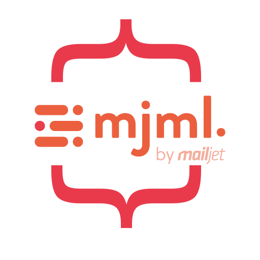

# mustache.mjml

> An email & html templating crossover.

<p align="center">
  
</p>

<p align="center">
  <a href="https://github.com/eugenioclrc/mustache.mjml/actions">
    
  </a>
</p>


---

# Introduction

`MJML` is a markup language created by [Mailjet](https://www.mailjet.com/) and designed to reduce the pain of coding a responsive email. Its semantic syntax makes the language easy and straightforward while its rich standard components library shortens your development time and lightens your email codebase. MJML’s open-source engine takes care of translating the `MJML` you wrote into responsive HTML.

[Mustache](http://mustache.github.com/) is a logic-less template syntax. It can be used for HTML, config files, source code - anything. It works by expanding tags in a template using values provided in a hash or object.


`Mustache.mjml` is a combination of both worlds.

## Install

You can get Mustache.mjml via [npm](http://npmjs.com).

```bash
$ npm install mustache-mjml --save
```


## Usage

Below is a quick example how to use mustache.mjml:

```js
import mustacheMjml from 'mustache-mjml';

const { template, errors } = mustacheMjml(`
  <mjml>
    <mj-body>
      <mj-section>
        <mj-column>
          <mj-text>
            Hello {{name}}, its time! {{now}}
          </mj-text>
        </mj-column>
      </mj-section>
    </mj-body>
  </mjml>
  `);

console.log('template warnings', errors);

const view = {
  name: "Joe",
  now: function () {
    return new Date();
  }
};

const output = template(view);
```

### loops
